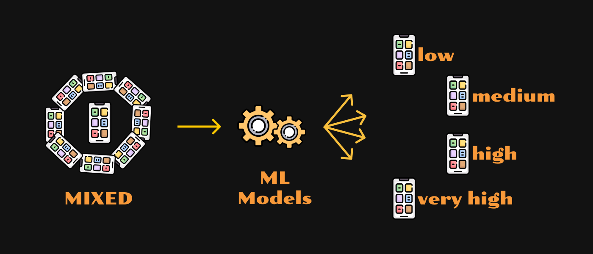



# Phone Price Segmentation using Machine Learning

- Train Dataset was categorised in 4 groups of price range

  - 0 (low cost)
  - 1 (medium cost)
  - 2 (high cost)
  - 3 (very high cost)

- Model was trained on 20 different features such as:

  - battery power
  - dual sim (has or not)
  - front camera megapixels
  - ram
  - wifi
  - 4G or not etc.

- Data Preprocessing

  - Pandas
  - Numpy
  - Standard Scaler

- Data Visualisation

  - Correlation heatmap
  - Seaborn
  - Matplotlib

- Classifiers

  - Random Forest
  - Support Vector Machine

Random Forest outperforms on train dataset. A comparison of both model prediciton shown in plot.
